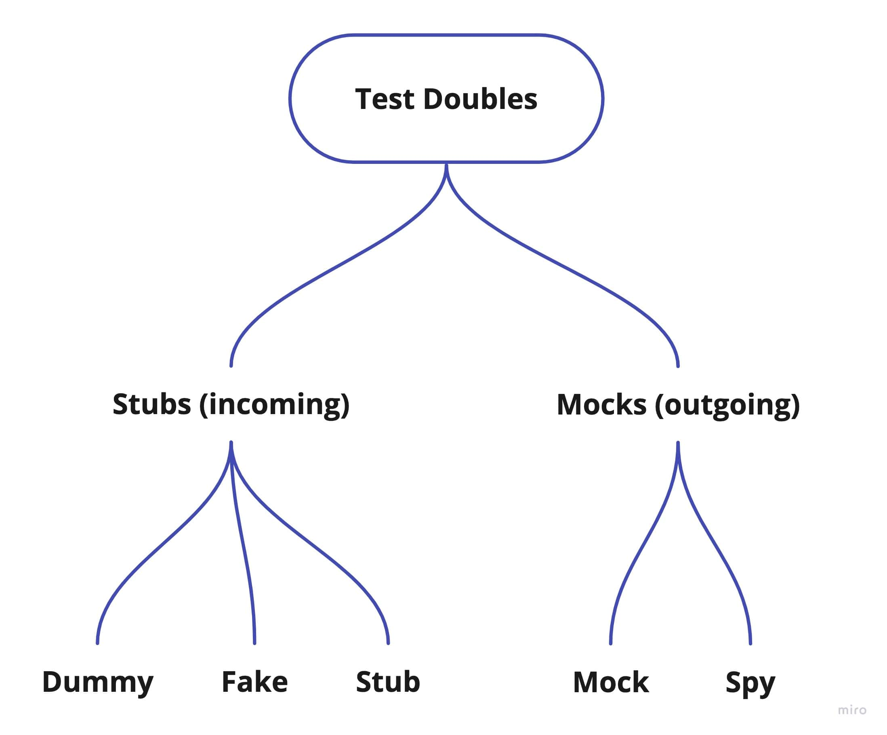

# Unit testing tips by examples in PHP

## Introduction

In these times, the benefits of writing unit tests are huge.
I think that most of the recently started projects contain any unit tests.
In enterprise applications with a lot of business logic, unit tests are the most important tests,
because they are fast and can us instantly assure that our implementation is correct.
However, I often see a problem with good tests in projects, though these tests' benefits are only huge when you have good unit tests.
So in these examples, I will try to share some tips on what to do to write good unit tests.

## Table of Contents

1. [Introduction](#introduction)
2. [Author](#author)
3. [Test doubles](#test-doubles)
4. [Naming](#naming)
5. [AAA pattern](#aaa-pattern)
6. [Object mother](#object-mother)
7. [Builder](#builder)
8. [Assert object](#assert-object)
9. [Parameterized test](#parameterized-test)
10. [Two schools of unit testing](#two-schools-of-unit-testing)
    * [Classical](#classical)
    * [Mockist](#mockist)
    * [Dependencies](#dependencies)
11. [Mock vs Stub](#mock-vs-stub)
12. [Three styles of unit testing](#three-styles-of-unit-testing)
    * [Output](#output)
    * [State](#state)
    * [Communication](#communication)
13. [Functional architecture and tests](#functional-architecture-and-tests)
14. [Observable behavior vs implementation details](#observable-behavior-vs-implementation-details)
15. [Unit of behavior](#unit-of-behavior)
16. [Humble pattern](#humble-pattern)
17. [Trivial test](#trivial-test)
18. [Fragile test](#fragile-test)
19. [Test fixtures](#test-fixtures)
20. [General testing anti-patterns](#general-testing-anti-patterns)
    * [Exposing private state](#exposing-private-state)
    * [Leaking domain details](#leaking-domain-details)
    * [Mocking concrete classes](#mocking-concrete-classes)
    * [Testing private methods](#testing-private-methods)
    * [Time as a volatile dependency](#time-as-a-volatile-dependency)
21. [100% Test Coverage shouldn't be the goal](#100-test-coverage-shouldnt-be-the-goal)
22. [Recommended books](#recommended-books)

## Author
:construction_worker: **Kamil Ruczyński**  
  
**Twitter:** [https://twitter.com/Sarvendev](https://twitter.com/Sarvendev)  
**Blog:** [https://sarvendev.com/](https://sarvendev.com/)  
**LinkedIn:** [https://www.linkedin.com/in/kamilruczynski/](https://www.linkedin.com/in/kamilruczynski/)

I have a lot of plans to write more about good practices, not only regarding unit tests, but also other levels of tests.
Of course, it requires a lot of time, so if you want to motivate me please give a star to this repository 
and follow me on Twitter and Github to be up-to-date with all updates.  

If you have any improvement ideas or a topic to write about, feel free to prepare a pull request or just let me know.

## Test doubles

Test doubles are fake dependencies used in tests.



### Stubs

#### Dummy

A dummy is a just simple implementation that does nothing.

```php
final class Mailer implements MailerInterface
{
    public function send(Message $message): void
    {
    }
}
```

#### Fake

A fake is a simplified implementation to simulate the original behavior.

```php
final class InMemoryCustomerRepository implements CustomerRepositoryInterface
{
    /**
     * @var Customer[]
     */
    private array $customers;

    public function __construct()
    {
        $this->customers = [];
    }

    public function store(Customer $customer): void
    {
        $this->customers[(string) $customer->id()->id()] = $customer;
    }

    public function get(CustomerId $id): Customer
    {
        if (!isset($this->customers[(string) $id->id()])) {
            throw new CustomerNotFoundException();
        }

        return $this->customers[(string) $id->id()];
    }

    public function findByEmail(Email $email): Customer
    {
        foreach ($this->customers as $customer) {
            if ($customer->getEmail()->isEqual($email)) {
                return $customer;
            }
        }

        throw new CustomerNotFoundException();
    }
}
```

#### Stub

A stub is the simplest implementation with a hardcoded behavior.

```php
final class UniqueEmailSpecificationStub implements UniqueEmailSpecificationInterface
{
    public function isUnique(Email $email): bool
    {
        return true;
    }
}
```

```php
$specificationStub = $this->createStub(UniqueEmailSpecificationInterface::class);
$specificationStub->method('isUnique')->willReturn(true);
```

### Mocks

#### Spy

A spy is an implementation to verify a specific behavior.

```php
final class Mailer implements MailerInterface
{
    /**
     * @var Message[]
     */
    private array $messages;
    
    public function __construct()
    {
        $this->messages = [];
    }

    public function send(Message $message): void
    {
        $this->messages[] = $message;
    }

    public function getCountOfSentMessages(): int
    {
        return count($this->messages);
    }
}
```

#### Mock

A mock is a configured imitation to verify calls on a collaborator.

```php
$message = new Message('test@test.com', 'Test', 'Test test test');
$mailer = $this->createMock(MailerInterface::class);
$mailer
    ->expects($this->once())
    ->method('send')
    ->with($this->equalTo($message));
```

| :exclamation: **WARNING:** |
|:---------------------------|
To verify incoming interactions, use a stub, but to verify outcoming interactions, use a mock. 
More: [Mock vs Stub](#mock-vs-stub)

### Always prefer own test double classes than those provided by a framework

| :x: **NOT GOOD:** |
|:------------------|

```php
final class TestExample extends TestCase
{
    /**
     * @test
     */
    public function sends_all_notifications(): void
    {
        $message1 = new Message();
        $message2 = new Message();
        $messageRepository = $this->createMock(MessageRepositoryInterface::class);
        $messageRepository->method('getAll')->willReturn([$message1, $message2]);
        $mailer = $this->createMock(MailerInterface::class);
        $sut = new NotificationService($mailer, $messageRepository);

        $mailer->expects(self::exactly(2))->method('send')
            ->withConsecutive([self::equalTo($message1)], [self::equalTo($message2)]);

        $sut->send();
    }
}
```

| :white_check_mark: **BETTER:** |
|:-------------------------------|

- **Better resistance to refactoring** 
  - Using Refactor->Rename on the particular method doesn't break the test
- **Better readability**
- **Lower cost of maintainability** 
  - Not required to learn those sophisticated mocks frameworks 
  - Just simple plain PHP code

```php
final class TestExample extends TestCase
{
    /**
     * @test
     */
    public function sends_all_notifications(): void
    {
        $message1 = new Message();
        $message2 = new Message();
        $messageRepository = new InMemoryMessageRepository();
        $messageRepository->save($message1);
        $messageRepository->save($message2);
        $mailer = new SpyMailer();
        $sut = new NotificationService($mailer, $messageRepository);

        $sut->send();
        
        $mailer->assertThatMessagesHaveBeenSent([$message1, $message2]);
    }
}
```

## Naming

| :x: **NOT GOOD:** |
|:------------------|

```php
public function test(): void
{
    $subscription = SubscriptionMother::new();

    $subscription->activate();

    self::assertSame(Status::activated(), $subscription->status());
}
```

| :white_check_mark: **Specify explicitly what you are testing** |
|:---------------------------------------------------------------|

```php
public function sut(): void
{
    // sut = System under test
    $sut = SubscriptionMother::new();

    $sut->activate();

    self::assertSame(Status::activated(), $sut->status());
}
``` 

| :x: **NOT GOOD:** |
|:------------------|
```php
public function it_throws_invalid_credentials_exception_when_sign_in_with_invalid_credentials(): void
{

}

public function testCreatingWithATooShortPasswordIsNotPossible(): void
{

}

public function testDeactivateASubscription(): void
{

}
```

| :white_check_mark: **Better** |
|:------------------------------|

- **Using underscore improves readability**
- **The name should describe the behavior, not the implementation**
- **Use names without technical keywords. It should be readable for a non-programmer person.**

```php
public function sign_in_with_invalid_credentials_is_not_possible(): void
{

}

public function creating_with_a_too_short_password_is_not_possible(): void
{

}

public function deactivating_an_activated_subscription_is_valid(): void
{

}

public function deactivating_an_inactive_subscription_is_invalid(): void
{

}
```

| :information_source: **INFORMATION:** |
|:--------------------------------------|

Describing the behavior is important in testing the domain scenarios. 
If your code is just a utility one it's less important.


| :question: **QUESTION:** |
|:-------------------------|

Why would it be useful for a non-programmer to read unit tests?  

If there is a project with complex domain logic, this logic must be very clear for everyone, 
so then tests describe domain details without technical keywords, and you can talk with a business in a language like in these tests.

All code that is related to the domain should be free from technical details. A non-programmer won't be read these tests. 
If you want to talk about the domain these tests will be useful to know what this domain does. 
There will be a description without technical details e.g., returns null, throws an exception, etc. 
This kind of information has nothing to do with the domain, so we shouldn't use these keywords.


## AAA pattern

It's also common Given, When, Then.

Separate three sections of the test:  

- **Arrange**: Bring the system under test in the desired state. Prepare dependencies, arguments and finally construct
the SUT.
- **Act**: Invoke a tested element.
- **Assert**: Verify the result, the final state, or the communication with collaborators.

| :white_check_mark: **GOOD** |
|:----------------------------|

```php
public function aaa_pattern_example_test(): void
{
    //Arrange|Given
    $sut = SubscriptionMother::new();

    //Act|When
    $sut->activate();

    //Assert|Then
    self::assertSame(Status::activated(), $sut->status());
}
```

## Object mother

The pattern helps to create specific objects which can be reused in a few tests. Because of that the arrange section
is concise and the test as a whole is more readable.

```php
final class SubscriptionMother
{
    public static function new(): Subscription
    {
        return new Subscription();
    }

    public static function activated(): Subscription
    {
        $subscription = new Subscription();
        $subscription->activate();
        return $subscription;
    }

    public static function deactivated(): Subscription
    {
        $subscription = self::activated();
        $subscription->deactivate();
        return $subscription;
    }
}
```

```php
final class ExampleTest
{
    public function example_test_with_activated_subscription(): void
    {
        $activatedSubscription = SubscriptionMother::activated();

        // do something

        // check something
    }

    public function example_test_with_deactivated_subscription(): void
    {
        $deactivatedSubscription = SubscriptionMother::deactivated();

        // do something

        // check something
    }
}
```

## Builder

Builder is another pattern that helps us to create objects in tests. Compared to Object Mother pattern Builder is better for creating
more complex objects.

```php
final class OrderBuilder
{
    private DateTimeImmutable|null $createdAt = null;

    /**
     * @var OrderItem[]
     */
    private array $items = [];

    public function createdAt(DateTimeImmutable $createdAt): self
    {
        $this->createdAt = $createdAt;
        return $this;
    }

    public function withItem(string $name, int $price): self
    {
        $this->items[] = new OrderItem($name, $price);
        return $this;
    }

    public function build(): Order
    {
        Assert::notEmpty($this->items);

        return new Order(
            $this->createdAt ?? new DateTimeImmutable(),
            $this->items,
        );
    }
}
```

```php
final class ExampleTest extends TestCase
{
    /**
     * @test
     */
    public function example_test_with_order_builder(): void
    {
        $order = (new OrderBuilder())
            ->createdAt(new DateTimeImmutable('2022-11-10 20:00:00'))
            ->withItem('Item 1', 1000)
            ->withItem('Item 2', 2000)
            ->withItem('Item 3', 3000)
            ->build();

        // do something

        // check something
    }
}
```

## Assert object

Assert object pattern helps write more readable assert sections. Instead of using a few asserts, we can just prepare an abstraction,
and use natural language to describe what result is expected.

```php
final class ExampleTest extends TestCase
{
    /**
     * @test
     */
    public function example_test_with_asserter(): void
    {
        $currentTime = new DateTimeImmutable('2022-11-10 20:00:00');
        $sut = new OrderService();

        $order = $sut->create($currentTime);

        OrderAsserter::assertThat($order)
            ->wasCreatedAt($currentTime)
            ->hasTotal(6000);
    }
}
```

```php
use PHPUnit\Framework\Assert;

final class OrderAsserter
{
    public function __construct(private readonly Order $order) {}

    public static function assertThat(Order $order): self
    {
        return new OrderAsserter($order);
    }

    public function wasCreatedAt(DateTimeImmutable $createdAt): self
    {
        Assert::assertEquals($createdAt, $this->order->createdAt);
        return $this;
    }

    public function hasTotal(int $total): self
    {
        Assert::assertSame($total, $this->order->getTotal());
        return $this;
    }
}
```

## Parameterized test

The parameterized test is a good option to test the SUT with many parameters without repeating the code.  

:thumbsdown: This kind of test is less readable. To increase the readability a little, negative and positive examples should be split up to different tests.

```php
final class ExampleTest extends TestCase
{
    /**
     * @test
     * @dataProvider getInvalidEmails
     */
    public function detects_an_invalid_email_address(string $email): void
    {
        $sut = new EmailValidator();

        $result = $sut->isValid($email);

        self::assertFalse($result);
    }

    /**
     * @test
     * @dataProvider getValidEmails
     */
    public function detects_an_valid_email_address(string $email): void
    {
        $sut = new EmailValidator();

        $result = $sut->isValid($email);

        self::assertTrue($result);
    }

    public function getInvalidEmails(): array
    {
        return [
            ['test'],
            ['test@'],
            ['test@test'],
            //...
        ];
    }

    public function getValidEmails(): array
    {
        return [
            ['test@test.com'],
            ['test123@test.com'],
            ['Test123@test.com'],
            //...
        ];
    }
}
```

## Two schools of unit testing

### Classical (Detroit school)

- The unit is a single unit of behavior, it can be a few related classes. 
- Every test should be isolated from others. So it must be possible to invoke them in parallel or in any order.

```php
final class TestExample extends TestCase
{
    /**
     * @test
     */
    public function suspending_an_subscription_with_can_always_suspend_policy_is_always_possible(): void
    {
        $canAlwaysSuspendPolicy = new CanAlwaysSuspendPolicy();
        $sut = new Subscription();

        $result = $sut->suspend($canAlwaysSuspendPolicy);

        self::assertTrue($result);
        self::assertSame(Status::suspend(), $sut->status());
    }
}
```

### Mockist (London school)

- The unit is a single class.
- The unit should be isolated from all collaborators.

```php
final class TestExample extends TestCase
{
    /**
     * @test
     */
    public function suspending_an_subscription_with_can_always_suspend_policy_is_always_possible(): void
    {
        $canAlwaysSuspendPolicy = $this->createStub(SuspendingPolicyInterface::class);
        $canAlwaysSuspendPolicy->method('suspend')->willReturn(true);
        $sut = new Subscription();

        $result = $sut->suspend($canAlwaysSuspendPolicy);

        self::assertTrue($result);
        self::assertSame(Status::suspend(), $sut->status());
    }
}
```

| :information_source: **INFORMATION:** |
|:--------------------------------------|

**The classical approach is better to avoid fragile tests.**

### Dependencies

[TODO]

## Mock vs. Stub

Example: 
```php
final class NotificationService
{
    public function __construct(
        private readonly MailerInterface $mailer,
        private readonly MessageRepositoryInterface $messageRepository
    ) {}

    public function send(): void
    {
        $messages = $this->messageRepository->getAll();
        foreach ($messages as $message) {
            $this->mailer->send($message);
        }
    }
}
```

| :x: **BAD:** |
|:-------------|

- **Asserting interactions with stubs leads to fragile tests**

```php
final class TestExample extends TestCase
{
    /**
     * @test
     */
    public function sends_all_notifications(): void
    {
        $message1 = new Message();
        $message2 = new Message();
        $messageRepository = $this->createMock(MessageRepositoryInterface::class);
        $messageRepository->method('getAll')->willReturn([$message1, $message2]);
        $mailer = $this->createMock(MailerInterface::class);
        $sut = new NotificationService($mailer, $messageRepository);

        $messageRepository->expects(self::once())->method('getAll');
        $mailer->expects(self::exactly(2))->method('send')
            ->withConsecutive([self::equalTo($message1)], [self::equalTo($message2)]);

        $sut->send();
    }
}
```

| :white_check_mark: **GOOD:** |
|:-----------------------------|

```php
final class TestExample extends TestCase
{
    /**
     * @test
     */
    public function sends_all_notifications(): void
    {
        $message1 = new Message();
        $message2 = new Message();
        $messageRepository = new InMemoryMessageRepository();
        $messageRepository->save($message1);
        $messageRepository->save($message2);
        $mailer = $this->createMock(MailerInterface::class);
        $sut = new NotificationService($mailer, $messageRepository);

        // Removed asserting interactions with the stub
        $mailer->expects(self::exactly(2))->method('send')
            ->withConsecutive([self::equalTo($message1)], [self::equalTo($message2)]);

        $sut->send();
    }
}
```

| :white_check_mark: **EVEN BETTER USING SPY:** |
|:----------------------------------------------|

```php
final class TestExample extends TestCase
{
    /**
     * @test
     */
    public function sends_all_notifications(): void
    {
        $message1 = new Message();
        $message2 = new Message();
        $messageRepository = new InMemoryMessageRepository();
        $messageRepository->save($message1);
        $messageRepository->save($message2);
        $mailer = new SpyMailer();
        $sut = new NotificationService($mailer, $messageRepository);

        $sut->send();
        
        $mailer->assertThatMessagesHaveBeenSent([$message1, $message2]);
    }
}
```

## Three styles of unit testing

### Output

| :white_check_mark: **The best option:** |
|:----------------------------------------|

- **The best resistance to refactoring**
- **The best accuracy**
- **The lowest cost of maintainability**  
- **If it is possible, you should prefer this kind of test**

```php
final class ExampleTest extends TestCase
{
    /**
     * @test
     * @dataProvider getInvalidEmails
     */
    public function detects_an_invalid_email_address(string $email): void
    {
        $sut = new EmailValidator();

        $result = $sut->isValid($email);

        self::assertFalse($result);
    }

    /**
     * @test
     * @dataProvider getValidEmails
     */
    public function detects_an_valid_email_address(string $email): void
    {
        $sut = new EmailValidator();

        $result = $sut->isValid($email);

        self::assertTrue($result);
    }

    public function getInvalidEmails(): array
    {
        return [
            ['test'],
            ['test@'],
            ['test@test'],
            //...
        ];
    }

    public function getValidEmails(): array
    {
        return [
            ['test@test.com'],
            ['test123@test.com'],
            ['Test123@test.com'],
            //...
        ];
    }
}
```

### State

| :heavy_minus_sign: **Worse option:** |
|:-------------------------------------|

- **Worse resistance to refactoring**
- **Worse accuracy**
- **Higher cost of maintainability**

```php
final class ExampleTest extends TestCase
{
    /**
     * @test
     */
    public function adding_an_item_to_cart(): void
    {
        $item = new CartItem('Product');
        $sut = new Cart();

        $sut->addItem($item);

        self::assertSame(1, $sut->getCount());
        self::assertSame($item, $sut->getItems()[0]);
    }
}
```

### Communication

| :x: **The worst option:** |
|:--------------------------|

- **The worst resistance to refactoring**
- **The worst accuracy**
- **The highest cost of maintainability**

```php
final class ExampleTest extends TestCase
{
    /**
     * @test
     */
    public function sends_all_notifications(): void
    {
        $message1 = new Message();
        $message2 = new Message();
        $messageRepository = new InMemoryMessageRepository();
        $messageRepository->save($message1);
        $messageRepository->save($message2);
        $mailer = $this->createMock(MailerInterface::class);
        $sut = new NotificationService($mailer, $messageRepository);

        $mailer->expects(self::exactly(2))->method('send')
            ->withConsecutive([self::equalTo($message1)], [self::equalTo($message2)]);

        $sut->send();
    }
}
```

## Functional architecture and tests

| :x: **BAD:** |
|:-------------|

```php
final class NameService
{
    public function __construct(private readonly CacheStorageInterface $cacheStorage) {}

    public function loadAll(): void
    {
        $namesCsv = array_map('str_getcsv', file(__DIR__.'/../names.csv'));
        $names = [];

        foreach ($namesCsv as $nameData) {
            if (!isset($nameData[0], $nameData[1])) {
                continue;
            }

            $names[] = new Name($nameData[0], new Gender($nameData[1]));
        }

        $this->cacheStorage->store('names', $names);
    }
}
```

**How to test a code like this? It is possible only with an integration test because it directly uses
an infrastructure code related to a file system.**

| :white_check_mark: **GOOD:** |
|:-----------------------------|

Like in functional architecture, we need to separate a code with side effects and code that contains only logic.

```php
final class NameParser
{
    /**
     * @param array<string[]> $namesData
     * @return Name[]
     */
    public function parse(array $namesData): array
    {
        $names = [];

        foreach ($namesData as $nameData) {
            if (!isset($nameData[0], $nameData[1])) {
                continue;
            }

            $names[] = new Name($nameData[0], new Gender($nameData[1]));
        }

        return $names;
    }
}
```

```php
final class CsvNamesFileLoader
{
    public function load(): array
    {
        return array_map('str_getcsv', file(__DIR__.'/../names.csv'));
    }
}
```

```php
final class ApplicationService
{
    public function __construct(
        private readonly CsvNamesFileLoader $fileLoader,
        private readonly NameParser $parser,
        private readonly CacheStorageInterface $cacheStorage
    ) {}

    public function loadNames(): void
    {
        $namesData = $this->fileLoader->load();
        $names = $this->parser->parse($namesData);
        $this->cacheStorage->store('names', $names);
    }
}
```

```php
final class ValidUnitExampleTest extends TestCase
{
    /**
     * @test
     */
    public function parse_all_names(): void
    {
        $namesData = [
            ['John', 'M'],
            ['Lennon', 'U'],
            ['Sarah', 'W']
        ];
        $sut = new NameParser();

        $result = $sut->parse($namesData);
        
        self::assertSame(
            [
                new Name('John', new Gender('M')),
                new Name('Lennon', new Gender('U')),
                new Name('Sarah', new Gender('W'))
            ],
            $result
        );
    }
}
```

## Observable behavior vs. implementation details

| :x: **BAD:** |
|:-------------|

```php
final class ApplicationService
{
    public function __construct(private readonly SubscriptionRepositoryInterface $subscriptionRepository) {}

    public function renewSubscription(int $subscriptionId): bool
    {
        $subscription = $this->subscriptionRepository->findById($subscriptionId);

        if (!$subscription->getStatus()->isEqual(Status::expired())) {
            return false;
        }

        $subscription->setStatus(Status::active());
        $subscription->setModifiedAt(new \DateTimeImmutable());
        return true;
    }
}
```

```php
final class Subscription
{
    public function __construct(private Status $status, private \DateTimeImmutable $modifiedAt) {}

    public function getStatus(): Status
    {
        return $this->status;
    }

    public function setStatus(Status $status): void
    {
        $this->status = $status;
    }

    public function getModifiedAt(): \DateTimeImmutable
    {
        return $this->modifiedAt;
    }

    public function setModifiedAt(\DateTimeImmutable $modifiedAt): void
    {
        $this->modifiedAt = $modifiedAt;
    }
}
```

```php
final class InvalidTestExample extends TestCase
{
    /**
     * @test
     */
    public function renew_an_expired_subscription_is_possible(): void
    {
        $modifiedAt = new \DateTimeImmutable();
        $expiredSubscription = new Subscription(Status::expired(), $modifiedAt);
        $sut = new ApplicationService($this->createRepository($expiredSubscription));

        $result = $sut->renewSubscription(1);

        self::assertSame(Status::active(), $expiredSubscription->getStatus());
        self::assertGreaterThan($modifiedAt, $expiredSubscription->getModifiedAt());
        self::assertTrue($result);
    }

    /**
     * @test
     */
    public function renew_an_active_subscription_is_not_possible(): void
    {
        $modifiedAt = new \DateTimeImmutable();
        $activeSubscription = new Subscription(Status::active(), $modifiedAt);
        $sut = new ApplicationService($this->createRepository($activeSubscription));

        $result = $sut->renewSubscription(1);

        self::assertSame($modifiedAt, $activeSubscription->getModifiedAt());
        self::assertFalse($result);
    }
    
    private function createRepository(Subscription $subscription): SubscriptionRepositoryInterface
    {
        return new class ($expiredSubscription) implements SubscriptionRepositoryInterface {
            public function __construct(private readonly Subscription $subscription) {} 
            
            public function findById(int $id): Subscription
            {
                return $this->subscription;
            }
        };
    }
}
```

| :white_check_mark: **GOOD:** |
|:-----------------------------|

```php
final class ApplicationService
{
    public function __construct(
        private readonly SubscriptionRepositoryInterface $subscriptionRepository
    ) {}

    public function renewSubscription(int $subscriptionId): bool
    {
        $subscription = $this->subscriptionRepository->findById($subscriptionId);
        return $subscription->renew(new \DateTimeImmutable());
    }
}
```

```php
final class Subscription
{
    private Status $status;
    private \DateTimeImmutable $modifiedAt;

    public function __construct(\DateTimeImmutable $modifiedAt)
    {
        $this->status = Status::new();
        $this->modifiedAt = $modifiedAt;
    }

    public function renew(\DateTimeImmutable $modifiedAt): bool
    {
        if (!$this->status->isEqual(Status::expired())) {
            return false;
        }

        $this->status = Status::active();
        $this->modifiedAt = $modifiedAt;
        return true;
    }

    public function active(\DateTimeImmutable $modifiedAt): void
    {
        //simplified
        $this->status = Status::active();
        $this->modifiedAt = $modifiedAt;
    }

    public function expire(\DateTimeImmutable $modifiedAt): void
    {
        //simplified
        $this->status = Status::expired();
        $this->modifiedAt = $modifiedAt;
    }

    public function isActive(): bool
    {
        return $this->status->isEqual(Status::active());
    }
}
```

```php
final class ValidTestExample extends TestCase
{
    /**
     * @test
     */
    public function renew_an_expired_subscription_is_possible(): void
    {
        $expiredSubscription = SubscriptionMother::expired();
        $sut = new ApplicationService($this->createRepository($expiredSubscription));

        $result = $sut->renewSubscription(1);

        // skip checking modifiedAt as it's not a part of observable behavior. To check this value we
        // would have to add a getter for modifiedAt, probably only for test purposes.
        self::assertTrue($expiredSubscription->isActive());
        self::assertTrue($result);
    }

    /**
     * @test
     */
    public function renew_an_active_subscription_is_not_possible(): void
    {
        $activeSubscription = SubscriptionMother::active();
        $sut = new ApplicationService($this->createRepository($activeSubscription));

        $result = $sut->renewSubscription(1);

        self::assertTrue($activeSubscription->isActive());
        self::assertFalse($result);
    }
    
    private function createRepository(Subscription $subscription): SubscriptionRepositoryInterface
    {
        return new class ($expiredSubscription) implements SubscriptionRepositoryInterface {
            public function __construct(private readonly Subscription $subscription) {} 
            
            public function findById(int $id): Subscription
            {
                return $this->subscription;
            }
        };
    }
}
```

| :information_source: **INFORMATION:** |
|:--------------------------------------|

The first subscription model has a bad design. To invoke one business operation you need to call three methods. Also using getters to verify operation is not a good practice.
In this case, it's skipped checking a change of `modifiedAt`, probably setting specific `modifiedAt` during a renew operation can be tested with an expiration business operation. The getter for `modifiedAt` is not required.
Of course, there are cases where finding the possibility to avoid getters provided only for tests will be very hard, but always we should try not to introduce them.

## Unit of behavior

| :x: **BAD:** |
|:-------------|

```php
class CannotSuspendExpiredSubscriptionPolicy implements SuspendingPolicyInterface
{
    public function suspend(Subscription $subscription, \DateTimeImmutable $at): bool
    {
        if ($subscription->isExpired()) {
            return false;
        }

        return true;
    }
}
```

```php
class CannotSuspendExpiredSubscriptionPolicyTest extends TestCase
{
    /**
     * @test
     */
    public function it_returns_false_when_a_subscription_is_expired(): void
    {
        $policy = new CannotSuspendExpiredSubscriptionPolicy();
        $subscription = $this->createStub(Subscription::class);
        $subscription->method('isExpired')->willReturn(true);

        self::assertFalse($policy->suspend($subscription, new \DateTimeImmutable()));
    }

    /**
     * @test
     */
    public function it_returns_true_when_a_subscription_is_not_expired(): void
    {
        $policy = new CannotSuspendExpiredSubscriptionPolicy();
        $subscription = $this->createStub(Subscription::class);
        $subscription->method('isExpired')->willReturn(false);

        self::assertTrue($policy->suspend($subscription, new \DateTimeImmutable()));
    }
}
```

```php
class CannotSuspendNewSubscriptionPolicy implements SuspendingPolicyInterface
{
    public function suspend(Subscription $subscription, \DateTimeImmutable $at): bool
    {
        if ($subscription->isNew()) {
            return false;
        }

        return true;
    }
}
```

```php
class CannotSuspendNewSubscriptionPolicyTest extends TestCase
{
    /**
     * @test
     */
    public function it_returns_false_when_a_subscription_is_new(): void
    {
        $policy = new CannotSuspendNewSubscriptionPolicy();
        $subscription = $this->createStub(Subscription::class);
        $subscription->method('isNew')->willReturn(true);

        self::assertFalse($policy->suspend($subscription, new \DateTimeImmutable()));
    }

    /**
     * @test
     */
    public function it_returns_true_when_a_subscription_is_not_new(): void
    {
        $policy = new CannotSuspendNewSubscriptionPolicy();
        $subscription = $this->createStub(Subscription::class);
        $subscription->method('isNew')->willReturn(false);

        self::assertTrue($policy->suspend($subscription, new \DateTimeImmutable()));
    }
}
```

```php
class CanSuspendAfterOneMonthPolicy implements SuspendingPolicyInterface
{
    public function suspend(Subscription $subscription, \DateTimeImmutable $at): bool
    {
        $oneMonthEarlierDate = \DateTime::createFromImmutable($at)->sub(new \DateInterval('P1M'));

        return $subscription->isOlderThan(\DateTimeImmutable::createFromMutable($oneMonthEarlierDate));
    }
}
```

```php
class CanSuspendAfterOneMonthPolicyTest extends TestCase
{
    /**
     * @test
     */
    public function it_returns_true_when_a_subscription_is_older_than_one_month(): void
    {
        $date = new \DateTimeImmutable('2021-01-29');
        $policy = new CanSuspendAfterOneMonthPolicy();
        $subscription = new Subscription(new \DateTimeImmutable('2020-12-28'));

        self::assertTrue($policy->suspend($subscription, $date));
    }

    /**
     * @test
     */
    public function it_returns_false_when_a_subscription_is_not_older_than_one_month(): void
    {
        $date = new \DateTimeImmutable('2021-01-29');
        $policy = new CanSuspendAfterOneMonthPolicy();
        $subscription = new Subscription(new \DateTimeImmutable('2020-01-01'));

        self::assertTrue($policy->suspend($subscription, $date));
    }
}
```

```php
class Status
{
    private const EXPIRED = 'expired';
    private const ACTIVE = 'active';
    private const NEW = 'new';
    private const SUSPENDED = 'suspended';

    private function __construct(private readonly string $status)
    {
        $this->status = $status;
    }

    public static function expired(): self
    {
        return new self(self::EXPIRED);
    }

    public static function active(): self
    {
        return new self(self::ACTIVE);
    }

    public static function new(): self
    {
        return new self(self::NEW);
    }

    public static function suspended(): self
    {
        return new self(self::SUSPENDED);
    }

    public function isEqual(self $status): bool
    {
        return $this->status === $status->status;
    }
}
```

```php
class StatusTest extends TestCase
{
    public function testEquals(): void
    {
        $status1 = Status::active();
        $status2 = Status::active();

        self::assertTrue($status1->isEqual($status2));
    }

    public function testNotEquals(): void
    {
        $status1 = Status::active();
        $status2 = Status::expired();

        self::assertFalse($status1->isEqual($status2));
    }
}
```

```php
class SubscriptionTest extends TestCase
{
    /**
     * @test
     */
    public function suspending_a_subscription_is_possible_when_a_policy_returns_true(): void
    {
        $policy = $this->createMock(SuspendingPolicyInterface::class);
        $policy->expects($this->once())->method('suspend')->willReturn(true);
        $sut = new Subscription(new \DateTimeImmutable());

        $result = $sut->suspend($policy, new \DateTimeImmutable());

        self::assertTrue($result);
        self::assertTrue($sut->isSuspended());
    }

    /**
     * @test
     */
    public function suspending_a_subscription_is_not_possible_when_a_policy_returns_false(): void
    {
        $policy = $this->createMock(SuspendingPolicyInterface::class);
        $policy->expects($this->once())->method('suspend')->willReturn(false);
        $sut = new Subscription(new \DateTimeImmutable());

        $result = $sut->suspend($policy, new \DateTimeImmutable());

        self::assertFalse($result);
        self::assertFalse($sut->isSuspended());
    }

    /**
     * @test
     */
    public function it_returns_true_when_a_subscription_is_older_than_one_month(): void
    {
        $date = new \DateTimeImmutable();
        $futureDate = $date->add(new \DateInterval('P1M'));
        $sut = new Subscription($date);

        self::assertTrue($sut->isOlderThan($futureDate));
    }

    /**
     * @test
     */
    public function it_returns_false_when_a_subscription_is_not_older_than_one_month(): void
    {
        $date = new \DateTimeImmutable();
        $futureDate = $date->add(new \DateInterval('P1D'));
        $sut = new Subscription($date);

        self::assertTrue($sut->isOlderThan($futureDate));
    }
}
```

| :exclamation: **WARNING:** |
|:---------------------------|

**Do not write code 1:1, 1 class : 1 test. It leads to fragile tests which make that refactoring is tough.**

| :white_check_mark: **GOOD:** |
|:-----------------------------|

```php
final class CannotSuspendExpiredSubscriptionPolicy implements SuspendingPolicyInterface
{
    public function suspend(Subscription $subscription, \DateTimeImmutable $at): bool
    {
        if ($subscription->isExpired()) {
            return false;
        }

        return true;
    }
}
```

```php
final class CannotSuspendNewSubscriptionPolicy implements SuspendingPolicyInterface
{
    public function suspend(Subscription $subscription, \DateTimeImmutable $at): bool
    {
        if ($subscription->isNew()) {
            return false;
        }

        return true;
    }
}
```

```php
final class CanSuspendAfterOneMonthPolicy implements SuspendingPolicyInterface
{
    public function suspend(Subscription $subscription, \DateTimeImmutable $at): bool
    {
        $oneMonthEarlierDate = \DateTime::createFromImmutable($at)->sub(new \DateInterval('P1M'));

        return $subscription->isOlderThan(\DateTimeImmutable::createFromMutable($oneMonthEarlierDate));
    }
}
```

```php
final class Status
{
    private const EXPIRED = 'expired';
    private const ACTIVE = 'active';
    private const NEW = 'new';
    private const SUSPENDED = 'suspended';

    private function __construct(private readonly string $status)
    {
        $this->status = $status;
    }

    public static function expired(): self
    {
        return new self(self::EXPIRED);
    }

    public static function active(): self
    {
        return new self(self::ACTIVE);
    }

    public static function new(): self
    {
        return new self(self::NEW);
    }

    public static function suspended(): self
    {
        return new self(self::SUSPENDED);
    }

    public function isEqual(self $status): bool
    {
        return $this->status === $status->status;
    }
}
```

```php
final class Subscription
{
    private Status $status;

    private \DateTimeImmutable $createdAt;

    public function __construct(\DateTimeImmutable $createdAt)
    {
        $this->status = Status::new();
        $this->createdAt = $createdAt;
    }

    public function suspend(SuspendingPolicyInterface $suspendingPolicy, \DateTimeImmutable $at): bool
    {
        $result = $suspendingPolicy->suspend($this, $at);
        if ($result) {
            $this->status = Status::suspended();
        }

        return $result;
    }

    public function isOlderThan(\DateTimeImmutable $date): bool
    {
        return $this->createdAt < $date;
    }

    public function activate(): void
    {
        $this->status = Status::active();
    }

    public function expire(): void
    {
        $this->status = Status::expired();
    }

    public function isExpired(): bool
    {
        return $this->status->isEqual(Status::expired());
    }

    public function isActive(): bool
    {
        return $this->status->isEqual(Status::active());
    }

    public function isNew(): bool
    {
        return $this->status->isEqual(Status::new());
    }

    public function isSuspended(): bool
    {
        return $this->status->isEqual(Status::suspended());
    }
}
```

```php
final class SubscriptionSuspendingTest extends TestCase
{
    /**
     * @test
     */
    public function suspending_an_expired_subscription_with_cannot_suspend_expired_policy_is_not_possible(): void
    {
        $sut = new Subscription(new \DateTimeImmutable());
        $sut->activate();
        $sut->expire();

        $result = $sut->suspend(new CannotSuspendExpiredSubscriptionPolicy(), new \DateTimeImmutable());

        self::assertFalse($result);
    }

    /**
     * @test
     */
    public function suspending_a_new_subscription_with_cannot_suspend_new_policy_is_not_possible(): void
    {
        $sut = new Subscription(new \DateTimeImmutable());

        $result = $sut->suspend(new CannotSuspendNewSubscriptionPolicy(), new \DateTimeImmutable());

        self::assertFalse($result);
    }

    /**
     * @test
     */
    public function suspending_an_active_subscription_with_cannot_suspend_new_policy_is_possible(): void
    {
        $sut = new Subscription(new \DateTimeImmutable());
        $sut->activate();

        $result = $sut->suspend(new CannotSuspendNewSubscriptionPolicy(), new \DateTimeImmutable());

        self::assertTrue($result);
    }

    /**
     * @test
     */
    public function suspending_an_active_subscription_with_cannot_suspend_expired_policy_is_possible(): void
    {
        $sut = new Subscription(new \DateTimeImmutable());
        $sut->activate();

        $result = $sut->suspend(new CannotSuspendExpiredSubscriptionPolicy(), new \DateTimeImmutable());

        self::assertTrue($result);
    }

    /**
     * @test
     */
    public function suspending_an_subscription_before_a_one_month_is_not_possible(): void
    {
        $sut = new Subscription(new \DateTimeImmutable('2020-01-01'));

        $result = $sut->suspend(new CanSuspendAfterOneMonthPolicy(), new \DateTimeImmutable('2020-01-10'));

        self::assertFalse($result);
    }

    /**
     * @test
     */
    public function suspending_an_subscription_after_a_one_month_is_possible(): void
    {
        $sut = new Subscription(new \DateTimeImmutable('2020-01-01'));

        $result = $sut->suspend(new CanSuspendAfterOneMonthPolicy(), new \DateTimeImmutable('2020-02-02'));

        self::assertTrue($result);
    }
}
```

## Humble pattern

How to properly unit test a class like this?

```php
class ApplicationService
{
    public function __construct(
        private readonly OrderRepository $orderRepository,
        private readonly FormRepository $formRepository
    ) {}

    public function changeFormStatus(int $orderId): void
    {
        $order = $this->orderRepository->getById($orderId);
        $soapResponse = $this->getSoapClient()->getStatusByOrderId($orderId);
        $form = $this->formRepository->getByOrderId($orderId);
        $form->setStatus($soapResponse['status']);
        $form->setModifiedAt(new \DateTimeImmutable());

        if ($soapResponse['status'] === 'accepted') {
            $order->setStatus('paid');
        }

        $this->formRepository->save($form);
        $this->orderRepository->save($order);
    }

    private function getSoapClient(): \SoapClient
    {
        return new \SoapClient('https://legacy_system.pl/Soap/WebService', []);
    }
}
```

| :white_check_mark: **GOOD:** |
|:-----------------------------|

It's required to split up an overcomplicated code to separate classes.

```php
final class ApplicationService
{
    public function __construct(
        private readonly OrderRepositoryInterface $orderRepository,
        private readonly FormRepositoryInterface $formRepository,
        private readonly FormApiInterface $formApi,
        private readonly ChangeFormStatusService $changeFormStatusService
    ) {}

    public function changeFormStatus(int $orderId): void
    {
        $order = $this->orderRepository->getById($orderId);
        $form = $this->formRepository->getByOrderId($orderId);
        $status = $this->formApi->getStatusByOrderId($orderId);

        $this->changeFormStatusService->changeStatus($order, $form, $status);

        $this->formRepository->save($form);
        $this->orderRepository->save($order);
    }
}
```

```php
final class ChangeFormStatusService
{
    public function changeStatus(Order $order, Form $form, string $formStatus): void
    {
        $status = FormStatus::createFromString($formStatus);
        $form->changeStatus($status);

        if ($form->isAccepted()) {
            $order->changeStatus(OrderStatus::paid());
        }
    }
}
```

```php
final class ChangingFormStatusTest extends TestCase
{
    /**
     * @test
     */
    public function changing_a_form_status_to_accepted_changes_an_order_status_to_paid(): void
    {
        $order = new Order();
        $form = new Form();
        $status = 'accepted';
        $sut = new ChangeFormStatusService();

        $sut->changeStatus($order, $form, $status);

        self::assertTrue($form->isAccepted());
        self::assertTrue($order->isPaid());
    }

    /**
     * @test
     */
    public function changing_a_form_status_to_refused_not_changes_an_order_status(): void
    {
        $order = new Order();
        $form = new Form();
        $status = 'new';
        $sut = new ChangeFormStatusService();

        $sut->changeStatus($order, $form, $status);

        self::assertFalse($form->isAccepted());
        self::assertFalse($order->isPaid());
    }
}
```

However, ApplicationService probably should be tested by an integration test with only mocked FormApiInterface.

## Trivial test

| :x: **BAD:** |
|:-------------|

```php
final class Customer
{
    public function __construct(private string $name) {}

    public function getName(): string
    {
        return $this->name;
    }

    public function setName(string $name): void
    {
        $this->name = $name;
    }
}
```

```php
final class CustomerTest extends TestCase
{
    public function testSetName(): void
    {
        $customer = new Customer('Jack');

        $customer->setName('John');

        self::assertSame('John', $customer->getName());
    }
}
```

```php
final class EventSubscriber
{
    public static function getSubscribedEvents(): array
    {
        return ['event' => 'onEvent'];
    }

    public function onEvent(): void
    {

    }
}
```

```php
final class EventSubscriberTest extends TestCase
{
    public function testGetSubscribedEvents(): void
    {
        $result = EventSubscriber::getSubscribedEvents();

        self::assertSame(['event' => 'onEvent'], $result);
    }
}
```

| :exclamation: **WARNING:** |
|:---------------------------|
Testing the code without any complicated logic is senseless, but also leads to fragile tests.

## Fragile test

| :x: **BAD:** |
|:-------------|

```php
final class UserRepository
{
    public function __construct(
        private readonly Connection $connection
    ) {}

    public function getUserNameByEmail(string $email): ?array
    {
        return $this
            ->connection
            ->createQueryBuilder()
            ->from('user', 'u')
            ->where('u.email = :email')
            ->setParameter('email', $email)
            ->execute()
            ->fetch();
    }
}
```

```php
final class TestUserRepository extends TestCase
{
    public function testGetUserNameByEmail(): void
    {
        $email = 'test@test.com';
        $connection = $this->createMock(Connection::class);
        $queryBuilder = $this->createMock(QueryBuilder::class);
        $result = $this->createMock(ResultStatement::class);
        $userRepository = new UserRepository($connection);
        $connection
            ->expects($this->once())
            ->method('createQueryBuilder')
            ->willReturn($queryBuilder);
        $queryBuilder
            ->expects($this->once())
            ->method('from')
            ->with('user', 'u')
            ->willReturn($queryBuilder);
        $queryBuilder
            ->expects($this->once())
            ->method('where')
            ->with('u.email = :email')
            ->willReturn($queryBuilder);
        $queryBuilder
            ->expects($this->once())
            ->method('setParameter')
            ->with('email', $email)
            ->willReturn($queryBuilder);
        $queryBuilder
            ->expects($this->once())
            ->method('execute')
            ->willReturn($result);
        $result
            ->expects($this->once())
            ->method('fetch')
            ->willReturn(['email' => $email]);

        $result = $userRepository->getUserNameByEmail($email);

        self::assertSame(['email' => $email], $result);
    }
}
```

| :exclamation: **WARNING:** |
|:---------------------------|
Testing repositories in that way leads to fragile tests and then refactoring is tough. To test repositories write integration tests.

## Test fixtures

| :white_check_mark: **GOOD:** |
|:-----------------------------|

```php
final class GoodTest extends TestCase
{
    private SubscriptionFactory $sut;

    public function setUp(): void
    {
        $this->sut = new SubscriptionFactory();
    }

    /**
     * @test
     */
    public function creates_a_subscription_for_a_given_date_range(): void
    {
        $result = $this->sut->create(new \DateTimeImmutable(), new \DateTimeImmutable('now +1 year'));

        self::assertInstanceOf(Subscription::class, $result);
    }

    /**
     * @test
     */
    public function throws_an_exception_on_invalid_date_range(): void
    {
        $this->expectException(CreateSubscriptionException::class);
        
        $result = $this->sut->create(new \DateTimeImmutable('now -1 year'), new \DateTimeImmutable());
    }
}
```

| :information_source: **INFORMATION:** |
|:--------------------------------------|

- The best case for using the setUp method will be testing stateless objects. 
- Any configuration made inside `setUp` couples tests together, and has impact on all tests.
- It's better to avoid a shared state between tests and configure the initial state accordingly to test method.
- Readability is worse compared to configuration made in the proper test method.

| :white_check_mark: **BETTER:** |
|:-------------------------------|
```php
final class BetterTest extends TestCase
{
    /**
     * @test
     */
    public function suspending_an_active_subscription_with_cannot_suspend_new_policy_is_possible(): void
    {
        $sut = $this->createAnActiveSubscription();

        $result = $sut->suspend(new CannotSuspendNewSubscriptionPolicy(), new \DateTimeImmutable());

        self::assertTrue($result);
    }

    /**
     * @test
     */
    public function suspending_an_active_subscription_with_cannot_suspend_expired_policy_is_possible(): void
    {
        $sut = $this->createAnActiveSubscription();

        $result = $sut->suspend(new CannotSuspendExpiredSubscriptionPolicy(), new \DateTimeImmutable());

        self::assertTrue($result);
    }

    /**
     * @test
     */
    public function suspending_a_new_subscription_with_cannot_suspend_new_policy_is_not_possible(): void
    {
        $sut = $this->createANewSubscription();

        $result = $sut->suspend(new CannotSuspendNewSubscriptionPolicy(), new \DateTimeImmutable());

        self::assertFalse($result);
    }

    private function createANewSubscription(): Subscription
    {
        return new Subscription(new \DateTimeImmutable());
    }

    private function createAnActiveSubscription(): Subscription
    {
        $subscription = new Subscription(new \DateTimeImmutable());
        $subscription->activate();
        
        return $subscription;
    }
}
```

| :information_source: **INFORMATION:** |
|:--------------------------------------|

- This approach improves readability and clarifies the separation (code is more read than written).
- Private helpers can be tedious to use in each test method, although they provide explicit intentions.

To share similar testing objects between multiple test classes use:
- [Object mother](#object-mother) 
- [Builder](#builder) 

## General testing anti-patterns

### Exposing private state

| :x: **BAD:** |
|:-------------|

```php
final class Customer
{
    private CustomerType $type;

    private DiscountCalculationPolicyInterface $discountCalculationPolicy;

    public function __construct()
    {
        $this->type = CustomerType::NORMAL();
        $this->discountCalculationPolicy = new NormalDiscountPolicy();
    }

    public function makeVip(): void
    {
        $this->type = CustomerType::VIP();
        $this->discountCalculationPolicy = new VipDiscountPolicy();
    }

    public function getCustomerType(): CustomerType
    {
        return $this->type;
    }

    public function getPercentageDiscount(): int
    {
        return $this->discountCalculationPolicy->getPercentageDiscount();
    }
}
```

```php
final class InvalidTest extends TestCase
{
    public function testMakeVip(): void
    {
        $sut = new Customer();
        $sut->makeVip();

        self::assertSame(CustomerType::VIP(), $sut->getCustomerType());
    }
}
```

| :white_check_mark: **GOOD:** |
|:-----------------------------|

```php
final class Customer
{
    private CustomerType $type;

    private DiscountCalculationPolicyInterface $discountCalculationPolicy;

    public function __construct()
    {
        $this->type = CustomerType::NORMAL();
        $this->discountCalculationPolicy = new NormalDiscountPolicy();
    }

    public function makeVip(): void
    {
        $this->type = CustomerType::VIP();
        $this->discountCalculationPolicy = new VipDiscountPolicy();
    }

    public function getPercentageDiscount(): int
    {
        return $this->discountCalculationPolicy->getPercentageDiscount();
    }
}
```

```php
final class ValidTest extends TestCase
{
    /**
     * @test
     */
    public function a_vip_customer_has_a_25_percentage_discount(): void
    {
        $sut = new Customer();
        $sut->makeVip();

        self::assertSame(25, $sut->getPercentageDiscount());
    }
}
```

| :exclamation: **WARNING:** |
|:---------------------------|

Adding additional production code (e.g. getter getCustomerType()) only to verify the state in tests is a bad practice.
It should be verified by another domain significant value (in this case getPercentageDiscount()). Of course, sometimes it can be tough to find another way to verify the operation, and we can be forced to add additional production code to verify correctness in tests, but we should try to avoid that.

### Leaking domain details

```php
final class DiscountCalculator
{
    public function calculate(int $isVipFromYears): int
    {
        Assert::greaterThanEq($isVipFromYears, 0);
        return min(($isVipFromYears * 10) + 3, 80);
    }
}
```

| :x: **BAD:** |
|:-------------|

```php
final class InvalidTest extends TestCase
{
    /**
     * @dataProvider discountDataProvider
     */
    public function testCalculate(int $vipDaysFrom, int $expected): void
    {
        $sut = new DiscountCalculator();

        self::assertSame($expected, $sut->calculate($vipDaysFrom));
    }

    public function discountDataProvider(): array
    {
        return [
            [0, 0 * 10 + 3], //leaking domain details
            [1, 1 * 10 + 3],
            [5, 5 * 10 + 3],
            [8, 80]
        ];
    }
}
```
| :white_check_mark: **GOOD:** |
|:-----------------------------|

```php
final class ValidTest extends TestCase
{
    /**
     * @dataProvider discountDataProvider
     */
    public function testCalculate(int $vipDaysFrom, int $expected): void
    {
        $sut = new DiscountCalculator();

        self::assertSame($expected, $sut->calculate($vipDaysFrom));
    }

    public function discountDataProvider(): array
    {
        return [
            [0, 3],
            [1, 13],
            [5, 53],
            [8, 80]
        ];
    }
}
```

| :information_source: **INFORMATION:** |
|:--------------------------------------|

Don't duplicate the production logic in tests. Just verify results by hardcoded values.

### Mocking concrete classes

| :x: **BAD:** |
|:-------------|

```php
class DiscountCalculator
{
    public function calculateInternalDiscount(int $isVipFromYears): int
    {
        Assert::greaterThanEq($isVipFromYears, 0);
        return min(($isVipFromYears * 10) + 3, 80);
    }

    public function calculateAdditionalDiscountFromExternalSystem(): int
    {
        // get data from an external system to calculate a discount
        return 5;
    }
}
```

```php
class OrderService
{
    public function __construct(private readonly DiscountCalculator $discountCalculator) {}

    public function getTotalPriceWithDiscount(int $totalPrice, int $vipFromDays): int
    {
        $internalDiscount = $this->discountCalculator->calculateInternalDiscount($vipFromDays);
        $externalDiscount = $this->discountCalculator->calculateAdditionalDiscountFromExternalSystem();
        $discountSum = $internalDiscount + $externalDiscount;
        return $totalPrice - (int) ceil(($totalPrice * $discountSum) / 100);
    }
}
```

```php
final class InvalidTest extends TestCase
{
    /**
     * @dataProvider orderDataProvider
     */
    public function testGetTotalPriceWithDiscount(int $totalPrice, int $vipDaysFrom, int $expected): void
    {
        $discountCalculator = $this->createPartialMock(DiscountCalculator::class, ['calculateAdditionalDiscountFromExternalSystem']);
        $discountCalculator->method('calculateAdditionalDiscountFromExternalSystem')->willReturn(5);
        $sut = new OrderService($discountCalculator);

        self::assertSame($expected, $sut->getTotalPriceWithDiscount($totalPrice, $vipDaysFrom));
    }

    public function orderDataProvider(): array
    {
        return [
            [1000, 0, 920],
            [500, 1, 410],
            [644, 5, 270],
        ];
    }
}
```

| :white_check_mark: **GOOD:** |
|:-----------------------------|


```php
interface ExternalDiscountCalculatorInterface
{
    public function calculate(): int;
}
```

```php
final class InternalDiscountCalculator
{
    public function calculate(int $isVipFromYears): int
    {
        Assert::greaterThanEq($isVipFromYears, 0);
        return min(($isVipFromYears * 10) + 3, 80);
    }
}
```

```php
final class OrderService
{
    public function __construct(
        private readonly InternalDiscountCalculator $discountCalculator,
        private readonly ExternalDiscountCalculatorInterface $externalDiscountCalculator
    ) {}

    public function getTotalPriceWithDiscount(int $totalPrice, int $vipFromDays): int
    {
        $internalDiscount = $this->discountCalculator->calculate($vipFromDays);
        $externalDiscount = $this->externalDiscountCalculator->calculate();
        $discountSum = $internalDiscount + $externalDiscount;
        return $totalPrice - (int) ceil(($totalPrice * $discountSum) / 100);
    }
}
```

```php
final class ValidTest extends TestCase
{
    /**
     * @dataProvider orderDataProvider
     */
    public function testGetTotalPriceWithDiscount(int $totalPrice, int $vipDaysFrom, int $expected): void
    {
        $externalDiscountCalculator = new class() implements ExternalDiscountCalculatorInterface {
            public function calculate(): int
            {
                return 5;
            }
        };
        $sut = new OrderService(new InternalDiscountCalculator(), $externalDiscountCalculator);

        self::assertSame($expected, $sut->getTotalPriceWithDiscount($totalPrice, $vipDaysFrom));
    }

    public function orderDataProvider(): array
    {
        return [
            [1000, 0, 920],
            [500, 1, 410],
            [644, 5, 270],
        ];
    }
}
```

| :information_source: **INFORMATION:** |
|:--------------------------------------|

The necessity to mock a concrete class to replace a part of its behavior means that this class is probably too complicated and violates the Single Responsibility Principle.

### Testing private methods

```php
final class OrderItem
{
    public function __construct(public readonly int $total) {}
}
```

```php
final class Order
{
    /**
     * @param OrderItem[] $items
     * @param int $transportCost
     */
    public function __construct(private array $items, private int $transportCost) {}

    public function getTotal(): int
    {
        return $this->getItemsTotal() + $this->transportCost;
    }

    private function getItemsTotal(): int
    {
        return array_reduce(
            array_map(fn (OrderItem $item) => $item->total, $this->items),
            fn (int $sum, int $total) => $sum += $total,
            0
        );
    }
}
```

| :x: **BAD:** |
|:-------------|


```php
final class InvalidTest extends TestCase
{
    /**
     * @test
     * @dataProvider ordersDataProvider
     */
    public function get_total_returns_a_total_cost_of_a_whole_order(Order $order, int $expectedTotal): void
    {
        self::assertSame($expectedTotal, $order->getTotal());
    }

    /**
     * @test
     * @dataProvider orderItemsDataProvider
     */
    public function get_items_total_returns_a_total_cost_of_all_items(Order $order, int $expectedTotal): void
    {
        self::assertSame($expectedTotal, $this->invokePrivateMethodGetItemsTotal($order));
    }

    public function ordersDataProvider(): array
    {
        return [
            [new Order([new OrderItem(20), new OrderItem(20), new OrderItem(20)], 15), 75],
            [new Order([new OrderItem(20), new OrderItem(30), new OrderItem(40)], 0), 90],
            [new Order([new OrderItem(99), new OrderItem(99), new OrderItem(99)], 9), 306]
        ];
    }

    public function orderItemsDataProvider(): array
    {
        return [
            [new Order([new OrderItem(20), new OrderItem(20), new OrderItem(20)], 15), 60],
            [new Order([new OrderItem(20), new OrderItem(30), new OrderItem(40)], 0), 90],
            [new Order([new OrderItem(99), new OrderItem(99), new OrderItem(99)], 9), 297]
        ];
    }

    private function invokePrivateMethodGetItemsTotal(Order &$order): int
    {
        $reflection = new \ReflectionClass(get_class($order));
        $method = $reflection->getMethod('getItemsTotal');
        $method->setAccessible(true);
        return $method->invokeArgs($order, []);
    }
}
```

| :white_check_mark: **GOOD:** |
|:-----------------------------|

```php
final class ValidTest extends TestCase
{
    /**
     * @test
     * @dataProvider ordersDataProvider
     */
    public function get_total_returns_a_total_cost_of_a_whole_order(Order $order, int $expectedTotal): void
    {
        self::assertSame($expectedTotal, $order->getTotal());
    }

    public function ordersDataProvider(): array
    {
        return [
            [new Order([new OrderItem(20), new OrderItem(20), new OrderItem(20)], 15), 75],
            [new Order([new OrderItem(20), new OrderItem(30), new OrderItem(40)], 0), 90],
            [new Order([new OrderItem(99), new OrderItem(99), new OrderItem(99)], 9), 306]
        ];
    }
}
```

| :exclamation: **WARNING** |
|:--------------------------|
Tests should only verify public API.

### Time as a volatile dependency

The time is a volatile dependency because it is non-deterministic. Each invocation returns a different result.

| :x: **BAD:** |
|:-------------|


```php
final class Clock
{
    public static \DateTime|null $currentDateTime = null;

    public static function getCurrentDateTime(): \DateTime
    {
        if (null === self::$currentDateTime) {
            self::$currentDateTime = new \DateTime();
        }

        return self::$currentDateTime;
    }

    public static function set(\DateTime $dateTime): void
    {
        self::$currentDateTime = $dateTime;
    }

    public static function reset(): void
    {
        self::$currentDateTime = null;
    }
}
```

```php
final class Customer
{
    private \DateTime $createdAt;

    public function __construct()
    {
        $this->createdAt = Clock::getCurrentDateTime();
    }

    public function isVip(): bool
    {
        return $this->createdAt->diff(Clock::getCurrentDateTime())->y >= 1;
    }
}
```

```php
final class InvalidTest extends TestCase
{
    /**
     * @test
     */
    public function a_customer_registered_more_than_a_one_year_ago_is_a_vip(): void
    {
        Clock::set(new \DateTime('2019-01-01'));
        $sut = new Customer();
        Clock::reset(); // you have to remember about resetting the shared state

        self::assertTrue($sut->isVip());
    }

    /**
     * @test
     */
    public function a_customer_registered_less_than_a_one_year_ago_is_not_a_vip(): void
    {
        Clock::set((new \DateTime())->sub(new \DateInterval('P2M')));
        $sut = new Customer();
        Clock::reset(); // you have to remember about resetting the shared state

        self::assertFalse($sut->isVip());
    }
}
```

| :white_check_mark: **GOOD:** |
|:-----------------------------|


```php
interface ClockInterface
{
    public function getCurrentTime(): \DateTimeImmutable;
}
```

```php
final class Clock implements ClockInterface
{
    private function __construct()
    {
    }

    public static function create(): self
    {
        return new self();
    }

    public function getCurrentTime(): \DateTimeImmutable
    {
        return new \DateTimeImmutable();
    }
}
```

```php
final class FixedClock implements ClockInterface
{
    private function __construct(private readonly \DateTimeImmutable $fixedDate) {}

    public static function create(\DateTimeImmutable $fixedDate): self
    {
        return new self($fixedDate);
    }

    public function getCurrentTime(): \DateTimeImmutable
    {
        return $this->fixedDate;
    }
}
```

```php
final class Customer
{
    public function __construct(private readonly \DateTimeImmutable $createdAt) {}

    public function isVip(\DateTimeImmutable $currentDate): bool
    {
        return $this->createdAt->diff($currentDate)->y >= 1;
    }
}
```

```php
final class ValidTest extends TestCase
{
    /**
     * @test
     */
    public function a_customer_registered_more_than_a_one_year_ago_is_a_vip(): void
    {
        $sut = new Customer(FixedClock::create(new \DateTimeImmutable('2019-01-01'))->getCurrentTime());

        self::assertTrue($sut->isVip(FixedClock::create(new \DateTimeImmutable('2020-01-02'))->getCurrentTime()));
    }

    /**
     * @test
     */
    public function a_customer_registered_less_than_a_one_year_ago_is_not_a_vip(): void
    {
        $sut = new Customer(FixedClock::create(new \DateTimeImmutable('2019-01-01'))->getCurrentTime());

        self::assertFalse($sut->isVip(FixedClock::create(new \DateTimeImmutable('2019-05-02'))->getCurrentTime()));
    }
}
```


| :information_source: **INFORMATION** |
|:-------------------------------------|

The time and random numbers should not be generated directly in the domain code. To test behavior we must have
deterministic results, so we need to inject these values into a domain object like in the example above.

## 100% Test Coverage shouldn't be the goal  

100% Coverage is not the goal or even is undesirable because if there is 100% coverage, tests probably will be very fragile, which means refactoring will be very hard.
Mutation testing gives better feedback about the quality of tests.
[Read more](https://sarvendev.com/en/2019/06/mutation-testing-we-are-testing-tests/)

## Recommended books

- [Test Driven Development: By Example / Kent Beck](https://amzn.to/3HImbax)  - the classic
- [Unit Testing Principles, Practices, and Patterns / Vladimir Khorikov](https://amzn.to/3PCMD7f) - the best book about tests I've ever read

## Author
:construction_worker: **Kamil Ruczyński**  
  
**Twitter:** [https://twitter.com/Sarvendev](https://twitter.com/Sarvendev)  
**Blog:** [https://sarvendev.com/](https://sarvendev.com/)  
**LinkedIn:** [https://www.linkedin.com/in/kamilruczynski/](https://www.linkedin.com/in/kamilruczynski/)  
